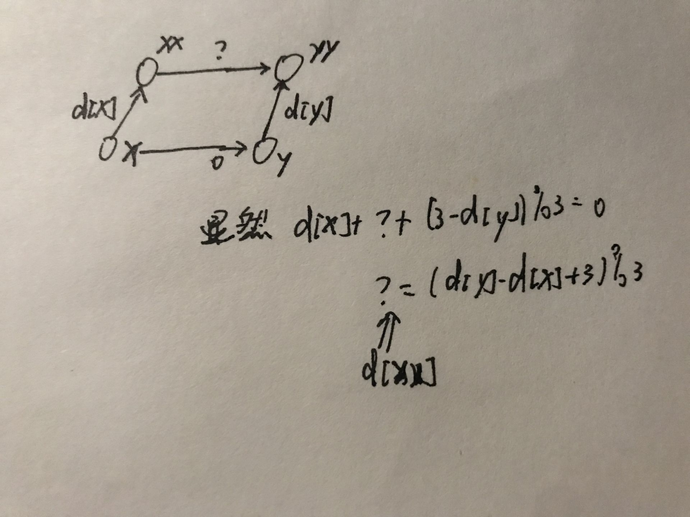
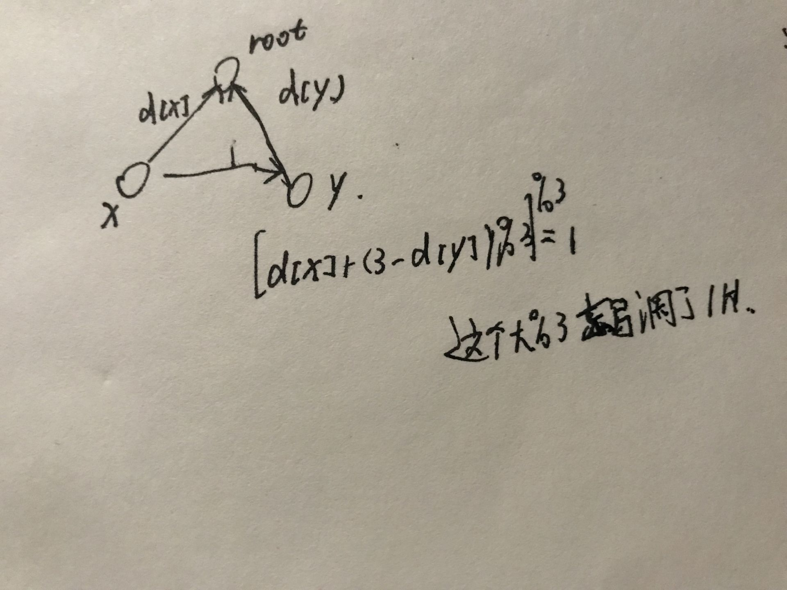

扩展的并查集原来学过 又忘了 水个文巩固一下..

<!-- more -->

没有了解过并查集出门左转[Oi-wiki](https://oi-wiki.org/ds/dsu/) 和 一道基本题目[程序自动分析](https://uoj.ac/problem/127)

# [CEOI-1999 Parity Game](http://poj.org/problem?id=1733)

这道题比较适合举例..

## 题目描述

小A给出一个长为N由0和1组成的序列S 一开始小B并不知道S的情况

小B给定M个询问 指定[l,r] 小A回答S[l,r]中有奇数个1还是偶数个

小B发现小A会撒谎 例如回答了S[1,3]中有奇数个1和S[4,6]中有偶数个1之后

现在又回答S[1,6]中有偶数个1 那么小A就是在撒谎

请指出一个最小的k 使得存在一个S满足前k个回答 不满足前k+1个回答的情况 $N\leq 10^9\ M\leq 5000$

## 思路

用a[]表示序列S的前缀和 如果S[l,r]中有偶数个1 那么a[l-1]和a[r]奇偶性相同 反之不同

类似程序自动分析 用并查集维护这个传递的关系 找到矛盾的地方停止

不同的是 在这里面同一集合内有两种关系 奇偶性相同、不同

考虑到N很大 M小 可以先离散化 将范围缩小

### 方法1 边带权并查集

类似的有[银河英雄传说](https://www.luogu.com.cn/problem/P1196)

维护一个数组d d[x]表示x到fa[x]之间的边权

在find函数里面递归的返回之前更新d[] 就可以统计每个节点到树根的路径上的信息的同时路径压缩

d[x]为0 表述x与fa[x]奇偶性相同 为1表示不同

在路径压缩的时候 对路径上的所有边权做异或运算 就可以得到与fa[x]之间的关系

考虑两个节点x y 如果他们在同一集合内 那么可以通过d[x]^d[y]得到他们之间的奇偶性关系

如果和已经记录的回答ans不同 那么这里就有矛盾

如果不在同一个集合之内 现在要合并fa[x] fa[y] 把x归入到y里面

合并之后可知ans=d[x]^d[y]^d[fa[x]] (这里的d[x] d[y]是更新之前的情况 即x->fa[x] y->fa[y])

可以知道如果要合并 那么d[fa[x]]=ans^d[x]^d[y] 同时fa[fa[x]]=fa[y]即可


```cpp
#include<cstdio>
#include<cstring>
#include<algorithm>
using namespace std;
const int N=5010;
struct {int l,r,ans;}query[N];
int a[N<<1],fa[N<<1],d[N<<1],n,m,t;
int get(int x){
	if(x==fa[x]) return x;
	int root=get(fa[x]);
	d[x]^=d[fa[x]];
	return fa[x]=root;
}
int main() {
	scanf("%d%d",&n,&m);
	for(int i=1;i<=m;i++){
		char str[5];
		scanf("%d%d%s",&query[i].l,&query[i].r,str);
		query[i].ans=(str[0]=='o'?1:0);
		a[++t]=query[i].l-1;a[++t]=query[i].r; // 离散化
	}
	sort(a+1,a+1+t);
	n=unique(a+1,a+1+t)-a-1;
	for(int i=1;i<=n;i++) fa[i]=i;
	for(int i=1;i<=m;i++){
		int x=lower_bound(a+1,a+1+n,query[i].l-1)-a;
		int y=lower_bound(a+1,a+1+n,query[i].r)-a;
		int p=get(x),q=get(y);
		if(p==q){
			if((d[x]^d[y])!=query[i].ans){
				printf("%d\n",i-1); return 0;
			}
		} else fa[p]=q,d[p]=d[x]^d[y]^query[i].ans;
	}
	printf("%d\n",m);
	return 0;
}
```


### 方法2 扩展域并查集

考虑奇偶性关联之外 再考虑具体的奇偶性质

对每个变量a[] 设置 a[i]odd a[i]even

开两倍空间 对于一对关系 l r even

有fa[a[l-1]even] = fa[a[r]even] 奇数情况同理

如果是奇偶性不同 则合并的时候调换

碰到与答案矛盾的时候 输出即可

空间开销和时间都比方法1要复杂 不过可能更好理解一点..


```cpp
#include <cstdio>
#include <algorithm>
#include <cstring>
using namespace std;
const int N=5010;
struct{int l,r,ans;}query[N];
int a[N<<1],fa[N<<2],n,m,t;
int get(int x){
	if(x==fa[x]) return x;
	return fa[x]=get(fa[x]);
}
int main() {
	scanf("%d%d",&n,&m);
	for(int i=1;i<=m;i++){
		char str[5];
		scanf("%d%d%s",&query[i].l,&query[i].r,str);
		query[i].ans=(str[0]=='o'?1:0);
		a[++t]=query[i].l-1,a[++t]=query[i].r;
	}
	sort(a+1,a+1+t); n=unique(a+1,a+t+1)-a-1;
	for(int i=1;i<=2*n;i++) fa[i]=i;
	for(int i=1;i<=m;i++){
		int x=lower_bound(a+1,a+1+n,query[i].l-1)-a;
		int y=lower_bound(a+1,a+1+n,query[i].r)-a;
		int x_odd=x,x_even=x+n;
		int y_odd=y,y_even=y+n;
		if(query[i].ans==0){
			if(get(x_odd)==get(y_even)){
				printf("%d",i-1);
				return 0;
			}
			fa[get(x_odd)]=get(y_odd);
			fa[get(x_even)]=get(y_even);
		}else{
			if(get(x_odd)==get(y_odd)){
				printf("%d\n",i-1);
				return 0;
			}
			fa[get(x_odd)]=get(y_even);
			fa[get(x_even)]=get(y_odd);
		}
	}
	printf("%d\n",m);
	return 0;
}
```


-----

非常经典的边带权和扩展域题目是[NOI2002银河英雄传说](https://www.luogu.com.cn/problem/P1196)和[NOI2001 食物链](https://www.luogu.com.cn/problem/P2024)

# [[NOI2002] 银河英雄传说](https://www.luogu.com.cn/problem/P1196)

设d[x]表示x到fa[x]之间的距离


```cpp
#include<bits/stdc++.h>
using namespace std;
int fa[30010],siz[30010],d[30010],t;
int find(int o){
	if(fa[o]==o) return o;
	int root=fa[o];
	fa[o]=find(fa[o]);
	d[o]+=d[root];
	return fa[o];
}
int main() {
	scanf("%d",&t);
	for(int i=1;i<=30000;i++) fa[i]=i,siz[i]=1;
	for(int i=1;i<=t;i++){
		char c[5];int x,y;
		scanf("%s %d %d", c+1, &x, &y);
		int fx=find(x),fy=find(y);
		if(c[1]=='M') { fa[fx]=fy; d[fx]=siz[fy]; siz[fy]+=siz[fx]; }
		else{
			if(fx!=fy) puts("-1");
			else cout<<abs(d[x]-d[y])-1<<'\n';
		}
	}
}
```


# [[NOI2001] 食物链](https://www.luogu.com.cn/problem/P2024)

扩展3倍空间 一开始想到的是分别设A B C

但是这样比较不好做 需要转换思路 设自身 食物 猎手


```cpp
#include <bits/stdc++.h>
using namespace std;
const int N=50010;
int n,k,ans,fa[N*3];
int get(int o){return fa[o]==o?o:fa[o]=get(fa[o]);}
int main(){
	ios_base::sync_with_stdio(false);
	cin.tie(nullptr);;
	cin>>n>>k;
	for(int i=1;i<=3*n;i++) fa[i]=i;
	for(int i=1;i<=k;i++){
		int op,x,y; cin>>op>>x>>y;
		if(x>n||y>n) {ans++; continue;}
		if(op==1){
			if(get(x+n)==get(y)||get(x+n+n)==get(y)){ ans++; continue; }
			fa[get(x)]=get(y); fa[get(x+n)]=get(y+n); fa[get(x+n+n)]=get(y+n+n);
		}else{
			if(get(x)==get(y)||get(x)==get(y+n)) {ans++; continue;}
			fa[get(x+n)]=get(y); fa[get(x+n+n)]=get(y+n); fa[get(x)]=get(y+n+n);
		}
	}
	cout<<ans<<endl;
	return 0;
}
```


额 其实食物链也可以带权 对于多种信息要传递的情况 带权好像都能处理

~~因此思路够清奇的话是不需要扩展域的？~~ 我随便口嗨的

至少这里的话就是把d[x]实打实的扩展了三倍 事实上只要用一个d[x]表示与根结点的关系就好了

设d[x]表示当前点与根结点的关系 0=相同 1=根结点是食物 2=根结点是猎手


```cpp
#include<bits/stdc++.h>
using namespace std;
int n,k,ans,fa[50010],d[50010];
int get(int o){
	if(o==fa[o]) return o;
	int root=get(fa[o]);
	d[o]=(d[o]+d[fa[o]])%3; // 回溯的时候更新 同时路径压缩
	return fa[o]=root;
}
int main() {
	ios_base::sync_with_stdio(false);
	cin.tie(nullptr);
	cin>>n>>k;
	for(int i=1;i<=n;i++) fa[i]=i;
	for(int i=1;i<=k;i++){
		int op,x,y;cin>>op>>x>>y;
		if(x>n||y>n) {ans++; continue;}
		int xx=get(x),yy=get(y);
		if(op==1){
			if(xx==yy&&d[x]!=d[y]) ans++;
			else if(xx!=yy) d[xx]=(d[y]-d[x]+3)%3, fa[xx]=fa[yy];
		}else{
			if(xx==yy&&((d[x]+(3-d[y])%3)%3!=1)){ ans++; continue; }
			if(xx!=yy) {fa[xx]=yy; d[xx]=(d[y]-d[x]+3+1)%3;}
		}
	}
	cout<<ans<<endl;
	return 0;
}
```


这玩意儿的时空比种类并查集略快一点 emm 说实话我觉得这两个东西其实没啥区别

只不过同一个状态一维也能维护、k维也能维护..

路径压缩部分没啥好说的 很好理解.

合并的时候可能有几个地方要注意下 这里又要摆出我的劣质图示了



x y相等的时候如何合并



x吃y的时候如何合并

本来想4:30睡的 结果一个地方漏打%3 现在5:30

搞了半天图片设置弄不好并列排放 随便丢上来 早上6点 开睡..

# 题目链接
* [模板](https://www.luogu.com.cn/problem/P3367)
* [NOI2015 程序自动分析](https://uoj.ac/problem/127)
* [POJ1456 Super Market](http://poj.org/problem?id=1456) 并查集+贪心
* [NOI2002 银河英雄传说](https://www.luogu.com.cn/problem/P1196) 边带权
* [POJ1733 Parity Game](http://poj.org/problem?id=1733) 边带权 ｜ 扩展域
* [NOI2001 食物链](https://www.luogu.com.cn/problem/P2024) 扩展域
* [BOI2003 团伙](https://www.luogu.com.cn/problem/P1892) 扩展域
* [NOIP2015TG 信息传递](https://www.luogu.com.cn/problem/P2661) 并查集求环
* [[USACO08DEC]Trick or Treat on the Farm G](https://www.luogu.com.cn/problem/P2921) 求环plus
* [NOIP2010TG 关押罪犯](https://www.luogu.com.cn/problem/P1525) 扩展域 ｜ 边带权
* [POJ2912 Rochambeau](http://poj.org/problem?id=2912) 扩展域 ｜ 边带权
* [POJ1417 True Liars](https://vjudge.net/problem/POJ-1417/origin) 并查集+背包

还有的与并查集关联的Tarjan 并查集用来求环 balabala的 有空更吧 先去玩会CSGO