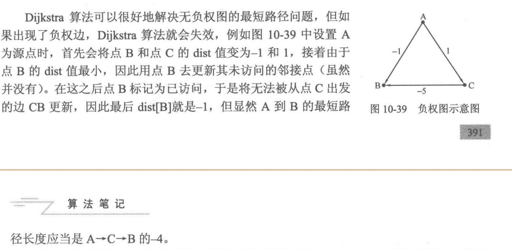

记搜写到NOIP2017逛公园的时候 发现之前一直说复习最短路

但是单源最短路的模板题提交记录上次还是2019年..

<!-- more -->

## 存图

### 直接存边

找边 O(m) | 找一个点的所有出边 O(m) | 遍历整个图 O(nm) | 空间复杂度O(m)

应用: Kruskal

```cpp
#include<bits/stdc++.h>
const int N=100010; // 点数
struct Edge {
  int u, v, w;
  bool operator<(const Edge &a) const {
    return w<a.w;
  }
};
int main() {
  int n, m;
  std::vector<Edge>e;
  std::bitset<N>vis; vis.reset();
  auto find_edge=[&](int u, int v)->bool {
    for (auto it:e) if (it.u==u&&it.v==v) return true;
    return false;
  };
  auto dfs=[&](auto self, int u)->void {
    if (vis[u]==1) return; vis[u]=1;
    for (auto it:e) if (it.u==u) self(self, it.v);
  };
  return 0;
}
```


### 邻接矩阵

不能考虑重边的影响

别的没啥了

### 邻接表

查询是否存在u到v的边: O($d^+$(u)) 如果排过序 那么可以二分 降到log

遍历点u所有出边: O($d^+$(u)) | 遍历整张图 O(n+m) | 空间复杂度 O(m)

存各种图都很好 尤其是需要对一个点的出边进行排序的时候 加个权值 排序的时候写个lambda 也很方便

```cpp
int main() {
  int n, m;
  cin >> n >> m;
  std::vector<std::vector<int>>adj(n + 1);
  std::bitset<100010>vis; vis.reset();
  for (int i=1; i<=m; i++) {
    int u, v; std::cin>>u>>v;
    adj[u].push_back(v);
  }
  auto find_edge=[&](int u, int v)->bool {
    for (auto it:adj[u])
      if (it==v) return true;
    return false;
  };
  auto dfs=[&](auto self, int u)->void {
    vis[u]==1;
    for (auto it:adj[u]) if (vis[it]==0) self(self, it);
  };
  return 0;
}
```


### 链式前向星

[为什么叫这个名字](https://www.zhihu.com/question/306076815/answer/741444152)

本质上是用链表实现的链式前向星 但是不依赖指针实现

不能对一个点的出边进行排序

优点是边是带编号的 奇数^1 = 成对的偶数 双向边可以以此来找反向边 常用于网络流

```cpp
const int N=1e5+5;
const int M=1e6+5;
int tot, nxt[M], to[M], head[N];
void add(int u, int v) { to[++tot]=v, nxt[tot]=head[u], head[u]=tot; }
int main() {
  int u;
  for (int i=head[u]; i; i=nxt[i]) {
    int y=to[i];
    /* code */
  }
  return 0;
}
```


---

## 单源最短路经

### Bellman-Ford

对于边$(u, v)$，松弛操作对应的式子: $dis(v) =${$dis(u) + w(u, v), dis(v)$}

每次循环O(m) 一次松弛操作最多使一条最短路的边数+1 最长的最短路至多长为n-1

因而算法是O(nm)的

下面这份代码跑单源最短路径只有84分 会T一个点

```cpp
const int N = 1e5 + 5;

int main() {
  std::vector<std::pair<int, int>>e[N];
  int dis[N];
  memset(dis, 0x7f, sizeof(dis));
  int n, m, s;
  std::cin >> n >> m >> s;
  for (int i = 1; i <= m; i++) {
    int u, v, w;
    std::cin >> u >> v >> w;
    e[u].push_back({v, w});
  }
  dis[s] = 0;
  bool flag = false;
  for (int i = 1; i < n; i++) { // 数据保证的情况下做n-1轮就可以了
    flag = false;
    for (int j = 1; j <= n; j++) {
      for (auto it : e[j]) {
        int to = it.first, val = it.second;
        if (dis[to] > dis[j] + val)
          dis[to] = dis[j] + val, flag = true;
      }
    }
    if (!flag)
      break;
  }
  for (int i = 1; i <= n; i++)
    std::cout << dis[i] << ' ';
  return 0;
}
```


### 判负环

如果松弛次数$\geq n$ 那么就会有一个负环包含在图里面

到n轮还没停下来那么可以判断从当前源点出发是达到一个负环的


```cpp
#include <bits/stdc++.h>
int main() {
  int T, n, m; std::cin >> T;
  int dis[2005];
  std::vector <std::pair<int, int>> e[2010];
  auto Bellman_Ford = [&]() -> bool {
    dis[1] = 0;
    bool flag;
    for (int i = 1; i <= n; i++) {
      flag = false;
      for (int u = 1; u <= n; u++) {
        if (dis[u] == 0x7fffffff) continue; // 如果当前这个点不能到 也就不能松弛
        for (auto eg : e[u]) {
          int v = eg.first, w = eg.second;
          if (dis[v] > dis[u] + w)
            dis[v] = dis[u] + w, flag = true;
        }
      }
      if (!flag) break;
    }
    return flag;
  };
  while (T--) {
    std::cin >> n >> m;
    for (int i=1;i<=n;i++) dis[i]=0x7fffffff;
    for (int i = 1; i <= n; i++)
      e[i].clear();
    for (int i = 1; i <= m; i++) {
      int u, v, w;
      std::cin >> u >> v >> w;
      if (w >= 0)
        e[u].push_back({v, w}), e[v].push_back({u, w});
      else
        e[u].push_back({v, w});
    }
    if (Bellman_Ford())
      puts("YES");
    else
      puts("NO");
  }
  return 0;
}
```


### SPFA

#### 流程

还是依赖松弛操作 有一源点s s入队

取出队头u 找出所有的($u, v$) 尝试松弛 能被松弛的点才能入队

这样就只访问了必要的边

```cpp
int main() {
  int n, m, s;
  std::cin >> n >> m >> s;
  std::bitset<100010>vis;
  std::vector dis(n + 1, 0x7fffffff);
  std::vector <std::vector<std::pair<int, int>>> e(n + 1);
  dis[s] = 0; vis.reset();
  std::queue <int> q;
  q.push(s);
  
  for (int i = 1; i <= m; i++) {
    int u, v, w;
    std::cin >> u >> v >> w;
    e[u].push_back({v, w});
  }

  while (!q.empty()) {
    int u = q.front(); vis[u] = 0; q.pop();
    for (auto eg : e[u]) {
      int v = eg.first, w = eg.second;
      if (dis[v] > dis[u] + w) {
        dis[v] = dis[u] + w;
        if (vis[v] == 0) {
          vis[v] = true;
          q.push(v);
        }
      }
    }
  }

  for (int i = 1; i <= n; i++)
    std::cout << dis[i] << ' ';
  return 0;
}
```


像[单源最短路径[标准版]](https://www.luogu.com.cn/problem/P4779) SPFA被卡到32分 而 Bellman-Ford 还有84分

[弱化版]的随机数据 SPFA 表现也不一定比 Bellman-Ford 好

#### [**洛谷 P3385[模板]负环**](https://www.luogu.com.cn/problem/P3385)

判断从点1出发能否到达一个负环

SPFA可以实现从指定源点出发到达一个负环的功能


```cpp
struct Edge {
  int v, w;
};

std::bitset <2010> vis;
std::vector <Edge> e[2010];
std::queue <int> q;
int T, n, m, dis[2010], cnt[2010];

int main() {
  std::cin >> T;
  auto SPFA = [&]() -> bool {
    for (int i = 1; i <= n; i++)
      dis[i] = 0x7fffffff, cnt[i] = 0;
    dis[1] = 0; vis[1] = true;
    q.push(1);
    while (!q.empty()) {
      int u = q.front();
      q.pop(), vis[u] = 0;
      for (auto ed : e[u]) {
        int v = ed.v, w = ed.w;
        if (dis[v] > dis[u] + w) {
          dis[v] = dis[u] + w;
          cnt[v] = cnt[u] + 1;
          if (cnt[v] >= n) return false;
          if (!vis[v]) vis[v] = 1, q.push(v);
        }
      }
    }
    return true;
  };
  while (T--) {
    while (!q.empty()) q.pop();
    vis.reset();
    std::cin >> n >> m;
    for (int i = 1; i <= n; i++) e[i].clear();
    for (int i = 1; i <= m; i++) {
      int u, v, w; std::cin >> u >> v >> w;
      if (w >= 0) e[u].push_back({v, w}), e[v].push_back({u, w});
      else e[u].push_back({v, w});
    }
    if (SPFA())
      puts("NO");
    else
      puts("YES");
  }
  return 0;
}
```


#### Bellman-Ford的其他优化

这个直接看OI-wiki上面的吧

每种优化都有对应的Hack 看[fstqwq的知乎回答](https://www.zhihu.com/question/292283275/answer/484871888)就好了

#### 题外话

我百度正确性 找hack数据的时候看到了[这一篇](https://blog.csdn.net/sidnee/article/details/106231883)博客 写的非常全面 包括一些历史..

### Dijkstra

条件是非负权图

#### 流程

节点分为两个集合 一个是确定了最短路径的{$S$}和未确定的{$T$}

初始化dis(s)=0 其余的dis均为$\infty$

然后重复一下操作直到$T$为空:

1. 从{$T$}中，选取最距离源点最近的结点，移到{$S$}中
2. 对刚刚加入{$S$}的结点的出边进行松弛

照这个思路 暴力.. O($N^2 + M$) = O($N ^ 2$)

无法处理带负权的图




```cpp
int main() {
  std::ios::sync_with_stdio(false);
  std::cin.tie(nullptr);

  int n, m, s;
  std::cin >> n >> m >> s;

  std::vector <std::vector<std::pair <int, int>> >adj(n + 1);
  std::vector <int> dis(n + 1, 0x7fffffff);
  std::bitset <10010> vis;

  for (int i = 0; i < m; i++) {
    int u, v, w;
    std::cin >> u >> v >> w;
    adj[u].push_back({v, w});
  }

  dis[s] = 0;
  int curr = s, Min = 0x7fffffff;
  while (vis[curr] == 0) {
    vis[curr] = 1;
    for (auto it : adj[curr]) {
      int to = it.first, val = it.second;
      if (vis[to] == 0 && dis[to] > dis[curr] + val)
        dis[to] = dis[curr] + val;
    }
    Min = 0x7fffffff;
    for (int i = 1; i <= n; i++)
      if (dis[i] < Min && vis[i] == 0)
        Min = dis[i], curr = i;
  }

  for (int i = 1; i <= n; i++)
    std::cout << dis[i] << ' ';
  return 0;
}
```

加速的关键在于维护操作1的最近{$T$}中节点

#### 二叉堆优化

用二叉堆维护 每成功松弛一条边$(u, v)$ 加入下一个节点{v, dis[v]} 如果已经有了v 我们只要进行更新就可以

操作1直接取堆顶即可 因此一共m次试图更新\插入操作 n次删除堆顶操作

复杂度$O((N + M)logN)$ = $O(MlogN)$

#### 优先队列优化

使用STL的优先队列的时候 由于我们不能修改或者删除在松弛时新插入的节点 所以元素的个数是$O(M)$的

总体时间复杂度在$O(MlogM)$

也是用的最多的模版之一了 网上一堆堆优化Dijkstra的 写出来的实际内容都还是STL priority_queue优化 包括一期洛谷日报 成功的带偏了复杂度分析 相比之下OI-wiki写的就很好


```cpp
struct Node {
  int u, w;
  bool operator<(const Node &a) const {
    return w > a.w;
  }
};

int main() {
  int n, m, s;
  std::cin >> n >> m >> s;
  std::priority_queue <Node> q;
  std::vector <std::vector<std::pair<int, int>>> e(n + 1);
  std::vector dis(n + 1, 0x7fffffff);
  
  for (int i = 1; i <= m; i++) {
    int u, v, w; std::cin >> u >> v >> w;
    e[u].push_back({v, w});
  }

  q.push({s, 0}); dis[s] = 0;
  while (!q.empty()) {
    int u = q.top().u, w = q.top().w; q.pop();
    if (w != dis[u]) continue;
    for (auto eg : e[u]) {
      int v = eg.first, val = eg.second;
      if (dis[v] > val + dis[u])
        dis[v] = dis[u] + val, q.push({v, dis[v]});
    }
  }

  for (int i = 1; i <= n; i++)
    std::cout << dis[i] << ' ';

  return 0;
}
```

#### Fibonacci堆优化

**我不会 以下内容来自[OI-wiki](https://oi-wiki.org/graph/shortest-path/#_11)** 什么时候回来再看情况填坑吧

和前面二者类似 但Fibonacci堆插入的时间复杂度为$O(1)$ 故时间复杂度为$O(nlogn+m)$=$O(nlogn)$ 时间复杂度最优

但因为Fibonacci堆较二叉堆不易实现 效率优势也不够大[$^{1}$](https://en.wikipedia.org/wiki/Fibonacci_heap#Worst_case) 算法竞赛中较少使用

#### 线段树优化

考虑Dijkstra过程 要求动态维护每个点的dis值 查询最小dis值的点u 要求能够更新指定点u的dis值

要能够更新指定节点u的话 感觉应该是用类似权值线段树的操作去维护 每个点存了当前区间dis值最小的{u, dis[u]}

如果要查询最近点u 拿出第一个就好了 如果要更新指定点u的dis值 就是权值树的写法

这东西调试给我调麻了

```cpp
#define N 100005
#define ls p << 1
#define rs p << 1 | 1
#define mid (l + r >> 1)

struct Node {
  int u, w;
} seg[N << 2];

void build(int p, int l, int r) { // 建树
  if (l == r) {
    seg[p] = (Node){l, INT_MAX};
    return;
  }
  build(ls, l, mid); build(rs, mid + 1, r);
  seg[p] = (Node){seg[ls].u, INT_MAX};
}

void mark(int p, int l, int r, int u, int w) { // 点修 和权值树的部分一样
  if (l == r) {
    seg[p].w = w;
    return;
  }
  if (u <= mid) mark(ls, l, mid, u, w);
  else mark(rs, mid + 1, r, u, w);
  if (seg[ls].w < seg[rs].w) seg[p] = seg[ls];
  else seg[p] = seg[rs];
}

int main() {
  int n, m, s, u, v, w;
  std::cin >> n >> m >> s;
  build(1, 1, n);
  std::vector <std::vector<std::pair<int, int>>> e(n + 1);
  std::vector dis(n + 1, INT_MAX);
  for (int i = 1; i <= m; i++) {
    std::cin >> u >> v >> w;
    e[u].push_back({v, w});
  }
  dis[s] = 0; mark(1, 1, n, s, 0);
  while (seg[1].w != INT_MAX) { // 最近的节点没有被更新过
    int u = seg[1].u;
    mark(1, 1, n, u, INT_MAX); // 等价于队列里面pop这个节点
    for (auto eg : e[u]) {
      int v = eg.first, w = eg.second;
      if (dis[v] > dis[u] + w) {
        dis[v] = dis[u] + w;
        mark(1, 1, n, v, dis[v]);
      }
    }
  }
  for (int i = 1; i <= n; i++) {
    std::cout << dis[i] << ' ';
  }
  return 0;
}
```

emmm 不难发现这个点修区间查的RMQ还有树状数组 zkw(好像会更快一点 但是我不会写)都能维护

我走了 我不打扰 感兴趣的大佬慢慢写

### 水题

#### [P1608 路径统计](https://www.luogu.com.cn/problem/P1608)

这个东西等同于[最短路计数](https://www.luogu.com.cn/problem/P1144) 只不过要考虑重边的影响 那么就用邻接矩阵来处理

写的时候堆优不知道那里写错了 着急吃饭 直接把最短路计数那份线段树优化的拿过来用了

反正这个调了也是浪费时间了..

```cpp
/* P1144 最短路计数 */
#include <bits/stdc++.h>
#define ls p << 1
#define rs p << 1 | 1
#define fi first
#define se second
#define mid (l + r >> 1)
#define mod 100003
#define N 2010
using namespace std;

int mp[N][N];

struct Node {
  int u, w;
  bool operator<(const Node &a) const {
    return w < a.w;
  }
} seg[N << 2];

void build(int p, int l, int r) {
  if (l == r) {
    seg[p] = {l, INT_MAX};
    return;
  }
  build(ls, l, mid); build(rs, mid + 1, r);
  seg[p] = seg[ls];
}

void mark(int p, int l, int r, int u, int w) {
  if (l == r) {
    seg[p].w = w;
    return;
  }
  if (u <= mid) mark(ls, l, mid, u, w);
  else mark(rs, mid + 1, r, u, w);
  if (seg[ls].w < seg[rs].w) seg[p] = seg[ls];
  else seg[p] = seg[rs];
}

int main() {
  int n, m;
  cin >> n >> m;
  vector dp(n + 1, 0);
  vector dis(n + 1, INT_MAX);
  
  for (int i = 1; i <= n; i++)
    for (int j = 1; j <= n; j++)
      mp[i][j] = INT_MAX;

  for (int i = 1; i <= m; i++) {
    int u, v, w;
    cin >> u >> v >> w;
    mp[u][v] = min(mp[u][v], w);
  }

  build(1, 1, n);
  dis[1] = 0, dp[1] = 1;
  mark(1, 1, n, 1, 0);

  while (seg[1].w != INT_MAX) {
    int u = seg[1].u;
    mark(1, 1, n, u, INT_MAX);
    for (int v = 1; v <= n; v++) {
      int w = mp[u][v];
      if (w == INT_MAX) continue;
      if (dis[v] > dis[u] + w) {
        dis[v] = dis[u] + w, dp[v] = dp[u];
        mark(1, 1, n, v, dis[v]);
      } else if (dis[v] == dis[u] + w) {
        dp[v] += dp[u];
      }
    }
  }
  if (dis[n] == INT_MAX) puts("No answer");
  else cout << dis[n] << ' ' << dp[n] << '\n';
  return 0;
}
```


## 全源最短路径

