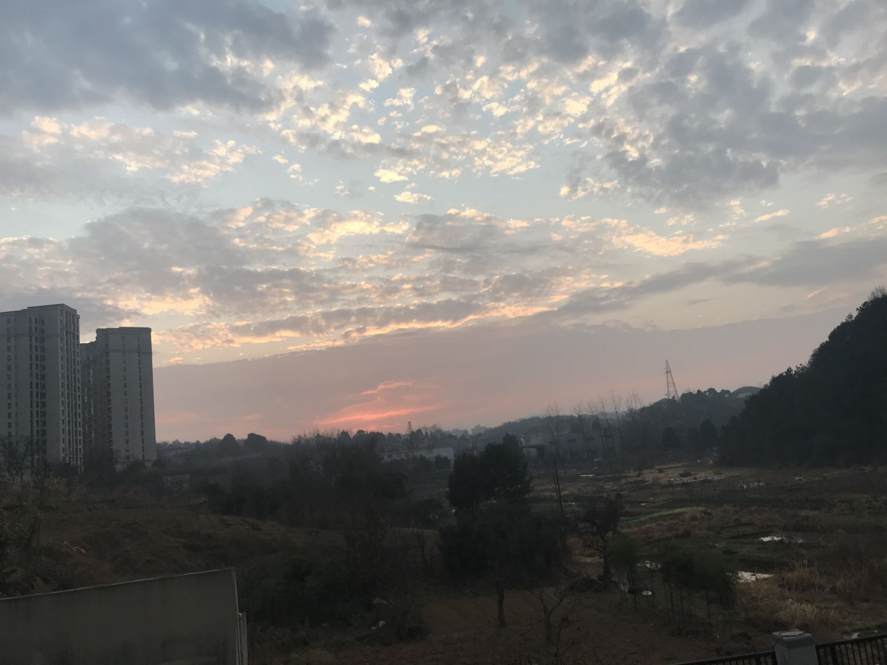
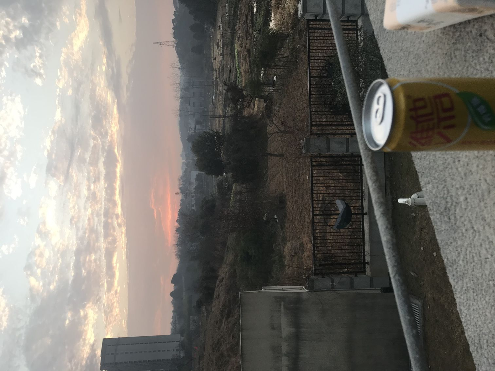
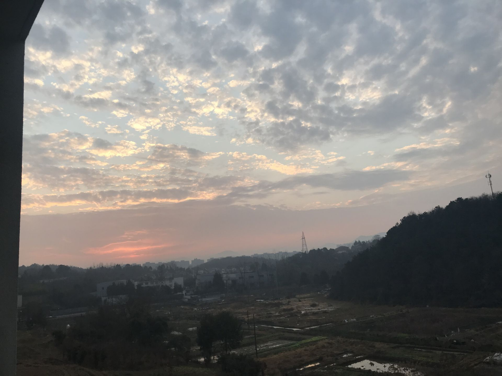
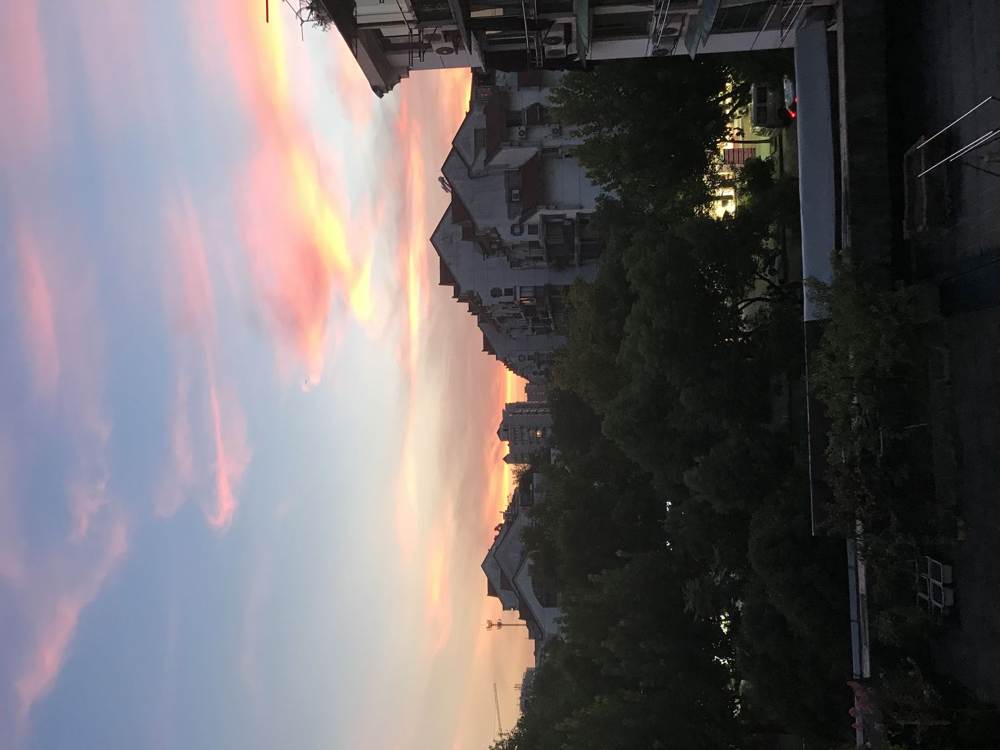
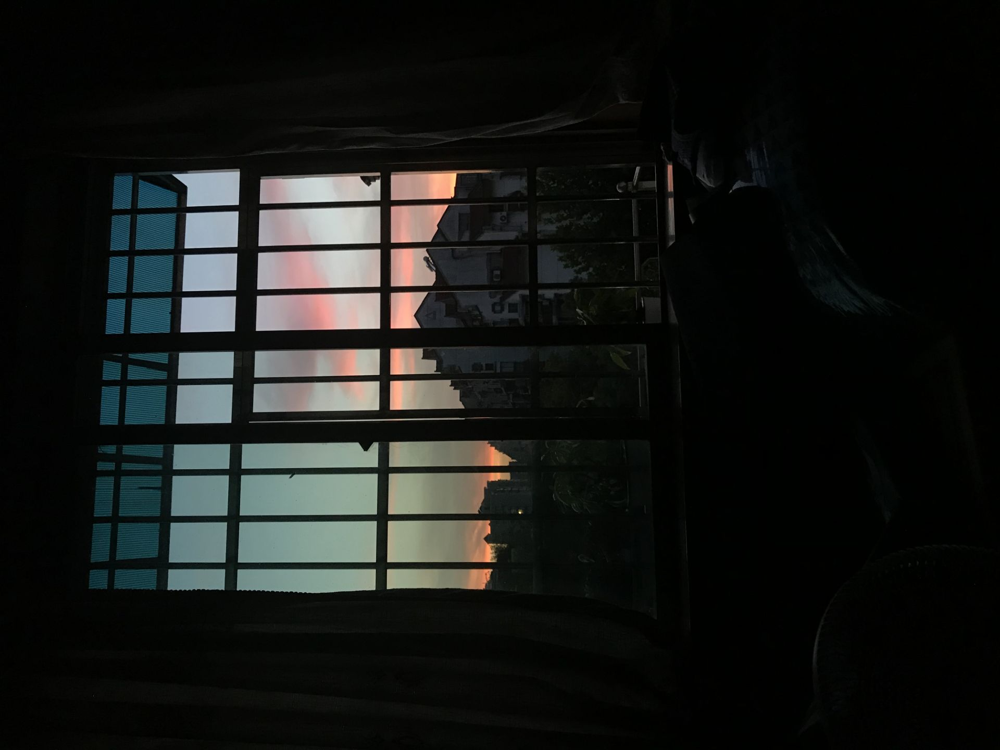

早上11点的时候突然很累 休息了一下 一不小心睡到了14点 做了一个梦 不太好

呆坐了一会 突然回忆起海创.

“想起高中的晚自习，连晚霞都是粉红色的”

<!-- more -->

这是在学校时早上冒死拍下的日出 我和wxy一致认为这很好看 我就拿出手机找机会拍了下来

晚霞没有机会拍到 只能是藏在记忆里 和海创的楼阁、远处的塔吊纠缠在一起

那时候很喜欢喝维他柠檬茶 高二高三好长一段时间机房里我的桌子上天天能看到这个

只有这个时候会遗憾高中没有踏实的努力 没有盲目而热烈的努力过

以致于现在回忆起来 也只有无谓的焦虑和操之过急的臆想

无论有没有疫情 前途或明或暗 现在是绝不可能再有以前轻盈而恣意的梦了

后面两张晚霞 拍摄在高考完的暑假 那天和她分别回到家 心情是热烈后的沉郁

我更喜欢后面一张 在房间里 熄了灯 拉一张椅子到窗前默默的坐着 看着窗外的美好

不知是否真的美好

不怎么会拍照 没研究过 也很可惜没有去研究一下 体会一下情趣 学会温柔

如今 所有人有各自的新的生活..

可能以后我会见识更绚丽的晚霞 可能和新的人分享那一瞬间的梦幻，可能是一直和xsq

但 那都是后来的事了